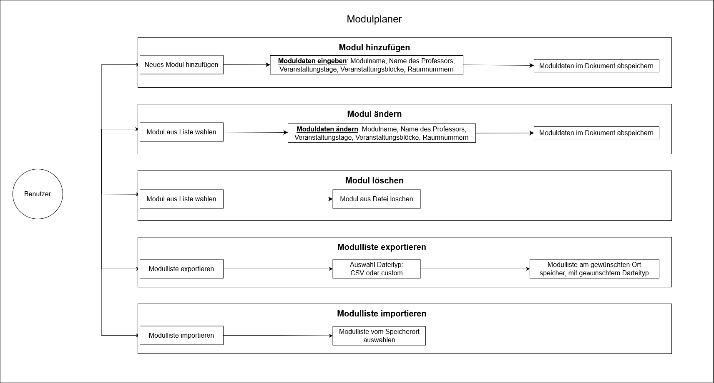

 

Projekt:  
Modulplaner-App: Benutzeroberfläche als Java-Anwendung

 
 

Vorgelegt von:

|                  |                    |                                           |
| ---------------  | ------------------ | ----------------------------------------- |
| Fricke, Niels    | Matr.-Nr.: 6049839 | E-Mail: niels.fricke@student.jade-hs.de    |
| Grimm, Daniel    | Matr.-Nr.: 6050543 | E-Mail: daniel.grimm@student.jade-hs.de   |
| Maasberg, Tjark  | Matr.-Nr.: 6030213 | E-Mail: tjark.maasberg@student.jade-hs.de |
|                  |                    |                                           |

 
 
 

Fachsemetser: 4  
Studiengang: Wirtschaftsinformatik
 
 
 
 
 

**Abgabefrist** : 22.01.2023  
**PrüferIn** : Prof. Gudenkauf

# Inhaltsverzeichnis

- [Inhaltsverzeichnis](#inhaltsverzeichnis)
- [1. Motivation](#1-motivation)
- [2. Anforderungsanalyse](#2-anforderungsanalyse)
- [3. Entwicklungsprozess](#3-entwicklungsprozess)
- [4. Use-Case Diagramm](#4-use-case-diagramm)
  - [4.1 Modul hinzufügen](#41-modul-hinzufügen)
  - [4.2 Modul bearbeiten](#42-modul-bearbeiten)
  - [4.3 Modul löschen](#43-modul-löschen)
- [5. Funktion](#5-funktion)
  - [5.1 Minimale Anforderung](#51-minimale-anforderung)
  - [5.2 Erweiterte Funktionen](#52-erweiterte-funktionen)
  - [5.3 Zukünftige Funktionen](#53-zukünftige-funktionen)

# 1. Motivation
Wir als Team entdeckten, dass es keine geeignete Methode für die unabhängige
Semesterplanung gab, als wir versuchten, unser Studium effektiv zu
organisieren. Viele Schüler verwendeten herkömmliche Software, die nicht für
die Komplexität des Prozesses konzipiert war, was viel Aufwand verursachte.
Die Software stellte für Quereinsteiger, die verschiedene Module aus
verschiedenen Semestern belegen mussten, eine Herausforderung dar.

Wir haben uns entschieden, eine Modulplaner-App zu entwickeln, um diesen
Engpass zu beheben. Unser Ziel war es, eine benutzerfreundliche Plattform zu
entwickeln, die nicht nur einfach zu bedienen ist, sondern auch die
Bedürfnisse jedes Schülers berücksichtigt.

Unsere Modulplaner-App soll den Verwaltungsaufwand reduzieren und
denStudierenden helfen,
mit Freude und Erfolg durch ihr Studium zu navigieren. Diese Anwendung ist
nicht nur eine
technische Lösung, sondern verspricht auch mehr Kontrolle über die eigene
Bildung und ein erfolgreiches Studium.  
 

# 2. Anforderungsanalyse
Die Entwicklung der Modulplaner-App wurde durch die Anforderungen und Ziele der
Studierenden initiiert, die nach einer effizienten Lösung zur Verwaltung ihres Studienplans
suchten. Als Anforderungssteller haben die Studierenden klare Erwartungen an
die Benutzerfreundlichkeit und Funktionalität der Anwendung formuliert, um ihre
individuellen Bedürfnisse bestmöglich zu erfüllen.

**Anforderungen der Studierenden: Benutzerfreundlichkeit und Funktionalität im Fokus**  
Im Mittelpunkt der Anforderungen steht die Benutzerfreundlichkeit. Die
Studierenden wünschen sich eine App, die einfach zu bedienen ist und dabei
ihre spezifischen Bedürfnisse im Studienalltag berücksichtigt. Dabei sollen
Funktionen wie die Anzeige aller Module des Studiengangs, die Planung von
Modulen, die Bearbeitung von Modulinformationen, die Generierung einer
Wochenübersicht, die individuelle Anpassung der Sprache sowie der Import und
Export von Modullisten integriert sein.

**Ziele der Modulplaner-App: Effizienz, Planung und Studienerfolg** 
Die Studierenden haben klare Ziele für die Modulplaner-App definiert. Die
Anwendung soll den Verwaltungsaufwand deutlich verringern, indem sie eine
effiziente Verwaltung des Studienplans ermöglicht. Gleichzeitig strebt die App
an, die Semesterplanung zu erleichtern, um den Studierenden dabei zu helfen,
ihr Studium effektiv zu planen und dadurch ihre Chancen auf Erfolg zu erhöhen
Ein weiteres Ziel ist die Steigerung der Zufriedenheit im Studium, indem die
App den Studierenden eine erfolgreiche und freudige Studienerfahrung
ermöglicht.

**Besondere Anforderungen im Fokus: Intuitive Benutzeroberfläche und Flexibilität** 
Die Studierenden haben besondere Anforderungen hervorgehoben, darunter die
Notwendigkeit einer intuitiven Benutzeroberfläche, die leicht verständlich
ist. Zudem ist eine flexible Planung von großer Bedeutung, damit die
Studierenden ihren Studienplan an ihre individuellen Bedürfnisse anpassen
können. Die App soll auch Quereinsteiger unterstützen, indem sie die
Möglichkeit bietet, Module aus verschiedenen Semestern zu planen.
 

<u>**Stichpunkte für bessere Orientierung:**</u>

Um eine klare und effiziente Übersicht zu gewährleisten, werden die zuvor
beschriebenen Punkte nun als prägnante Stichpunkte aufgeführt. Diese dienen
nicht nur als Orientierungshilfe und Richtlinien, sondern auch als Leitfaden
für die zielgerichtete Entwicklung der Modulplaner-App.

**Anforderungssteller** : Studierende

**Anforderungsziel** : Entwicklung einer Modulplaner-App

**Anforderungsbereiche** :

- **Benutzerfreundlichkeit:** Die App soll einfach zu bedienen sein und die Bedürfnisse jedes Studierenden berücksichtigen.

- **Funktionalität:** Die App soll folgende Funktionen bieten:
  - Anzeige aller Module des Studiengangs
  - Möglichkeit, Module zu planen
  - Möglichkeit, Modulinformationen zu verändern
  - Möglichkeit, eine Wochenübersicht zu generieren
  - Möglichkeit, die Sprache individuell anzupassen
  - Möglichkeit, Modullisten Im- oder Exportieren

**Ziele der Modulplaner-App** :

- **Verringerung des Verwaltungsaufwands:** Die App soll den Studierenden
helfen, ihren Studienplan zu verwalten und so Zeit und Aufwand zu sparen.

- **Erleichterung der Semesterplanung:** Die App soll den Studierenden helfen,
ihr Studium effektiv zu planen und so ihre Chancen auf Erfolg zu erhöhen.

- **Steigerung der Zufriedenheit mit dem Studium:** Die App soll den
Studierenden helfen, ihr Studium mit Freude und Erfolg zu absolvieren.

**Besondere Anforderungen** :

- **Intuitive Benutzeroberfläche:** Die App soll eine intuitive
Benutzeroberfläche haben, die leicht zu verstehen ist.

- **Flexible Planung:** Die App soll eine flexible Planung ermöglichen, damit
die Studierenden ihren Studienplan an ihre individuellen Bedürfnisse anpassen
können.

- **Unterstützung von Quereinsteigern:** Die App soll die Bedürfnisse von
Quereinsteigern berücksichtigen, z. B. durch die Möglichkeit, Module aus
verschiedenen Semestern zu planen.  

# 3. Entwicklungsprozess
Unser Team verwendete Agile Entwicklung, um die Modulplaner-App flexibel zu
gestalten. Durch die klare Struktur von überschaubaren Tickets erleichterte
Trello die Aufgabenverwaltung. Diese Methode ermöglichte einen klaren
Überblick und verteilte im Team klare Verantwortungen.

Trello förderte die effektive Zusammenarbeit und ermöglichte eine
kontinuierliche Erfolgsverfolgung. Die klare Verteilung von Tickets stellte
sicher, dass jedes Teammitglied über seine Aufgaben informiert war, was zum
erfolgreichen Abschluss des Modulplaner-App-Projekts beitrug. Unsere agile
Methode ermöglichte eine termingerechte Fertigstellung und die Entwicklung
einer qualitativ hochwertigen Anwendung.

Diese Dokumentation gewährt einen Einblick in unsere Teamarbeit und die
Anwendung von Trello. Bei weiterem Informationsbedarf stehen wir gerne zur
Verfügung.
 

# 4. Use-Case Diagramm
Das Use-Case-Diagramm zeigt die Interaktion zwischen einem Benutzer und
unserer Modulplaner-App. Der Benutzer kann ein Modul hinzufügen, bearbeiten
oder löschen.

Dieses Use-Case-Diagramm ist sehr einfach gehalten und beschreibt nur die
grundlegenden Funktionen unserer Modulplaner-App. Es kann natürlich erweitert
werden, um weitere Funktionen zu beschreiben, z. B.:

- Modulplan anzeigen: Der Benutzer kann einen Modulplan anzeigen, der alle
Module und deren Abhängigkeiten enthält.
- Modulplan exportieren: Der Benutzer kann einen Modulplan in ein anderes
Format exportieren, z. B. CSV.

## 4.1 Modul hinzufügen

Der Benutzer wählt den Menüpunkt "Modul hinzufügen" aus. Das System zeigt dann
ein Formular an, in das der Benutzer die folgenden Moduldaten eingeben kann:

- Modulname
- Name des Professors
- Note
- Versuch
- Kurs URL
- Veranstaltungstag
- Veranstaltungsblock
- Veranstaltungsraum

Der Benutzer kann auch angeben, ob das Modul in der Wochenübersicht angezeigt
werden soll. Wenn der Benutzer diese Option auswählt, wird das Modul in der
Wochenübersicht angezeigt, wenn der Benutzer den entsprechenden Menüpunkt
auswählt.

Wenn der Benutzer alle erforderlichen Daten eingegeben hat, wählt er den
Button "Speichern". Das System speichert dann die Moduldaten in einer lokalen
Datei.
 

## 4.2 Modul bearbeiten

Der Benutzer wählt das Modul aus, das er bearbeiten möchte. Das System zeigt
dann ein Formular an, in das der Benutzer die gewünschten Moduldaten ändern
kann. Der Benutzer kann dieselben Moduldaten ändern wie beim Hinzufügen eines
Moduls.

Wenn der Benutzer alle gewünschten Änderungen vorgenommen hat, wählt er den
Button "Speichern". Das System aktualisiert dann das Modul in der lokalen
Datei.
 

## 4.3 Modul löschen

Der Benutzer wählt das Modul aus, das er löschen möchte. Das System löscht
dann das Modul aus der lokalen Datei, sobald der Button "Löschen" betätigt
wird.

# 5. Funktion
Die Modulplaner-Anwendung wurde mit einem klaren Fokus auf Effizienz und
Benutzerfreundlichkeit entwickelt. Dieses Kapitel beleuchtet die verschiedenen
Funktionen, die im Laufe der Entwicklung implementiert wurden, um den
Bedürfnissen der Nutzer gerecht zu werden. Dabei werden sowohl die minimalen
Anforderungen, die jedes Modul erfüllen muss, als auch die erweiterten
Funktionen, die über die ursprünglichen Vorgaben hinausgehen, detailliert
betrachtet.
 

## 5.1 Minimale Anforderung

Während des Entwicklungsprozesses eines neuen Moduls werden die grundlegenden
Anforderungen rasch deutlich. Ein neu erstelltes Objekt, in diesem Fall ein
Modul, erhält stets einen eindeutigen Namen. Dieser Name dient zur
Repräsentation des Moduls und wird zusammen mit weiteren Werten gespeichert.
Jedes Modul wird durch eine ganze Zahl identifiziert, die den Tag und den
zugehörigen Zeitblock kennzeichnet. Zusätzlich erhält das neue Modul
standardmäßig eine Gleitkommazahl mit dem Wert 0.0, die die Note des Moduls
repräsentiert. Des Weiteren wird ein boolescher Wert gespeichert, der angibt,
ob das Modul belegt ist oder nicht. Dies sind die minimalen Anforderungen, die
für jedes erstellte Objekt in den angelegten und neuen Modulen gespeichert
werden.

Auf dem Hauptfenster der Anwendung werden die Mindestanforderungen des
Programms sichtbar. Die stets aktuelle Liste befindet sich auf der linken
Seite unter der Überschrift "Kursliste". Das Hinzufügen eines neuen Objekts
erfolgt mithilfe eines zusätzlichen Dialogs, der auf verschiedene Weisen
erreicht werden kann. Durch die Auswahl eines Moduls aus der Liste werden im
Hauptfenster weitere Funktionen sichtbar. Hier können die Attribute der Module 
bearbeitet oder das Modul gelöscht werden.

Durch das Hinzufügen, Bearbeiten oder Löschen eines Moduls wird das Modul in
einer lokal gespeicherten Datei abgespeichert. Die "Kursliste" im Hauptfenster
zeigt stets die aktuellste Liste an, was das korrekte Speichern und Lesen der
Module ermöglicht.
 

## 5.2 Erweiterte Funktionen

Während der Weiterentwicklung unserer Anwendung haben wir zusätzliche
Funktionen implementiert, die über die ursprünglichen Anforderungen
hinausgehen. Jedes Modul verfügt nun neben den Basisattributen über ein
weitere Merkmale – den Professorname, der aktuelle Verusch, sowie die Kurs URL. Diese Erweiterung ermöglicht eine
genauere Identifikation und Darstellung jedes Moduls.

Eine weitere bedeutende Neuerung besteht darin, dass nun mehrere
Veranstaltungen für ein Modul eingetragen werden können. Dies ist besonders
hilfreich, wenn ein Modul an verschiedenen Tagen, zu unterschiedlichen Zeiten
und möglicherweise sogar in verschiedenen Räumen stattfindet. Diese
Flexibilität in der Veranstaltungsplanung erleichtert die Organisation und den
Überblick für die Studierenden erheblich.

Im Hauptfenster der Anwendung haben wir ebenfalls erweiterte Funktionen
integriert. Die "Kursliste" verfügt nun über eine durchdachte Suchfunktion,
die die Groß- und Kleinschreibung beachtet. Dies ermöglicht eine präzise Suche
nach bestimmten Modulen oder Professoren.

Eine zusätzliche Liste zeigt bereits bestandene Module an und gibt
gleichzeitig einen Überblick über den Durchschnittsnotenstand. So erhalten die
Studierenden nicht nur eine Übersicht über ihre aktuellen Module, sondern auch
eine Zusammenfassung ihrer bisherigen Leistungen.

Die Wochenübersicht, die die Belegung eines Moduls darstellt, wurde ebenfalls
erweitert. Während der bool'sche Wert angibt, ob ein Modul belegt ist oder
nicht, wird es nun auch in der Wochenübersicht von Montag bis Samstag und in
den Blöcken 1 bis 7 visualisiert. Diese zusätzliche Information erleichtert
die Planung und Koordination der Veranstaltungen.

Um die Bedienung der Anwendung weiter zu optimieren, haben wir verschiedene
Zugangswege geschaffen. Neben der bekannten Menübar und Toolbar stehen nun
auch implementierte Shortcuts für geübte Benutzer zur Verfügung. Dies
ermöglicht eine effiziente Navigation und Nutzung der Anwendung.

Unter dem Menüpunkt "Anzeige" in der Menübar bieten wir die Möglichkeit,
benutzerdefinierte Ansichten zu erstellen. Dies ermöglicht es den Nutzern,
bestimmte Elemente nach ihren individuellen Bedürfnissen ein- oder
auszublenden, um eine persönlich angepasste Arbeitsumgebung zu schaffen.

Eine weitere innovative Funktion ist die Auswahl der Anzeigesprache. Die
Anwendung unterstützt verschiedene Sprachen, darunter Deutsch, Englisch (als
Standard), Französisch oder sogar Klingonisch. Je nach ausgewählter Sprache
wird auch die Hilfeseite, die sich als PDF öffnet, entsprechend angezeigt.
Englisch dient dabei als Default-Sprache für diejenigen, für die noch keine
spezifische Hilfeseite verfügbar ist, beispielsweise für Klingonisch.

Zusätzlich haben wir dafür gesorgt, dass die Javadocs vorhanden sind und der Code einfach anpassbar ist. Die Anpassung der verfügbaren Tags sowie der Blöcke und die Konfiguration der Anzahl der Veranstaltungen können nun allesamt an einer Stelle vorgenommen werden, um die Wartung und Erweiterung des Codes zu erleichtern.
 

## 5.3 Zukünftige Funktionen
Die Modulplaner-App bietet bereits eine solide Basis für die Studienplanung,
doch es gibt immer Raum für zukünftige Entwicklungen und Erweiterungen. Hier
sind einige mögliche Funktionen, die in kommenden Versionen der App
implementiert werden.

**Notenstatistiken:** 
Die Integration erweiterter Funktionen zur Anzeige von Notenstatistiken könnte
den Studierenden helfen, ihre Leistungen besser zu verstehen und ihre
Studienstrategien zu optimieren. Hierbei könnten detaillierte Auswertungen zu
Durchschnittsnoten, Bestehensquoten und individuellen Leistungen in
verschiedenen Modulen angeboten werden.

**Erinnerungen und Benachrichtigungen:** 
Die Einführung von Erinnerungsfunktionen für wichtige Termine und Deadlines
wäre eine wertvolle Ergänzung. Benachrichtigungen über anstehende Prüfungen,
Modulanmeldungen oder andere relevante Ereignisse könnten den Studierenden
dabei helfen, gut organisiert zu bleiben und keine wichtigen Termine zu
verpassen.

**Interaktiver Stundenplan:** 
Die Möglichkeit, den Stundenplan interaktiv zu gestalten, wäre eine innovative
Funktion. Studierende könnten Module direkt im Stundenplan verschieben und
anpassen, um eine bessere Visualisierung ihres individuellen Studienplans zu
ermöglichen. Diese Funktion könnte die Flexibilität und Benutzerfreundlichkeit
der App weiter steigern.

**Duale Studiengang-Unterstützung:** 
Die Anpassung der App, um duale Studiengänge zu unterstützen, wäre eine
bedeutende Erweiterung. Hierbei könnten Vorlesungen an der Hochschule ebenso
wie Arbeitseinsätze berücksichtigt werden. Die App könnte eine integrierte
Darstellung beider Aspekte ermöglichen, um Studierenden in dualen
Studiengängen eine umfassende Planung zu ermöglichen.

Diese vorgeschlagenen Erweiterungen würden die Modulplaner-App zu einem noch
leistungsfähigeren Werkzeug für Studierende machen und ihnen eine noch
umfassendere Unterstützung bei der Organisation ihres Studiums bieten.

**Unterscheidung nach Studienrichtungen für schnellen Wechsel:** 
Eine weitere zukünftige Funktion könnte die Möglichkeit sein, verschiedene Studienrichtungen in der App zu hinterlegen. Dies würde einen schnelleren Wechsel innerhalb des Modulplaners ermöglichen, indem die Modulliste entsprechend für den ausgewählten Studiengang angepasst wird.

Diese vorgeschlagenen Erweiterungen würden die Modulplaner-App zu einem noch
leistungsfähigeren Werkzeug für Studierende machen und ihnen eine noch
umfassendere Unterstützung bei der Organisation ihres Studiums bieten.